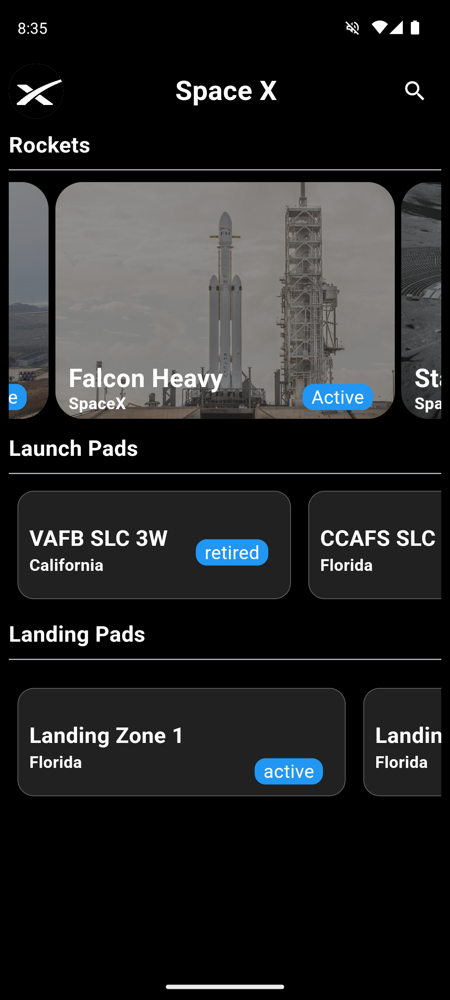
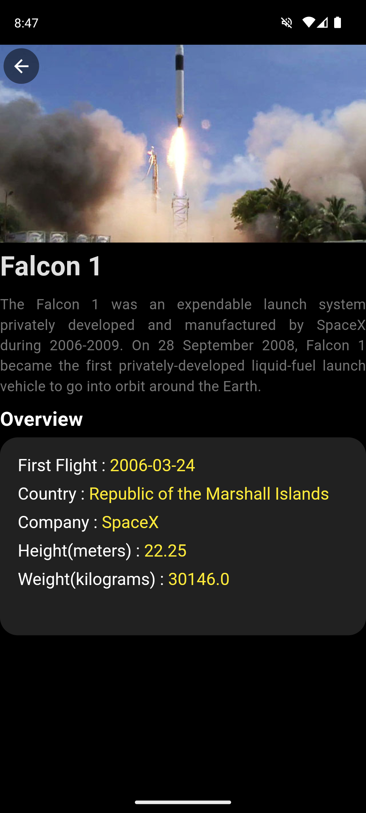
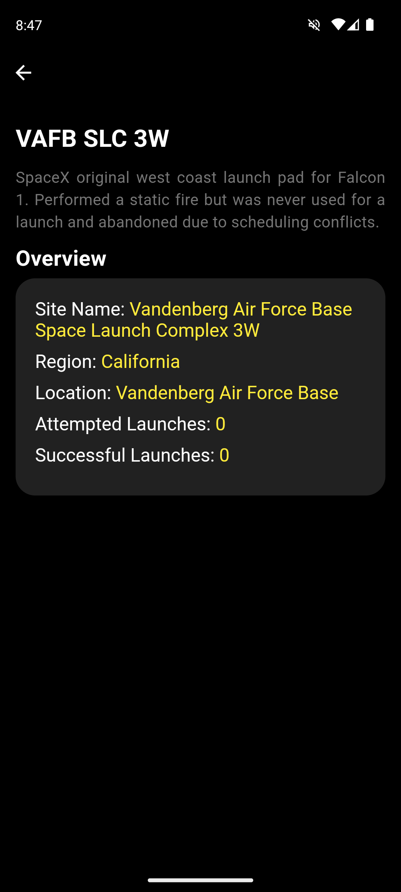

# 🚀 SpaceX Flutter App

## Overview

Welcome to the SpaceX Flutter App! This app provides an interactive and engaging way to explore SpaceX data, focusing on rockets, launchpads, and landing pads. Built using Flutter and the SpaceX API, this app aims to offer a seamless user experience with a sleek and modern design.

## Features

- 🚀 **Rocket Info**: Get specifications and details about SpaceX rockets.
- 🏢 **Launchpads**: Explore details of SpaceX launchpads around the world.
- 🛬 **Landing Pads**: View information about SpaceX landing pads.

## Screenshots

### API Key

This app uses the SpaceX API, which does not require an API key. You can find more information about the API [here](https://docs.spacexdata.com/).

## Usage

Once the app is running, you can navigate through different sections using the bottom navigation bar:

- **Rockets**: Detailed information about SpaceX rockets.
- **Launchpads**: Information and details about SpaceX launchpads.
- **Landing Pads**: Information and details about SpaceX landing pads.

